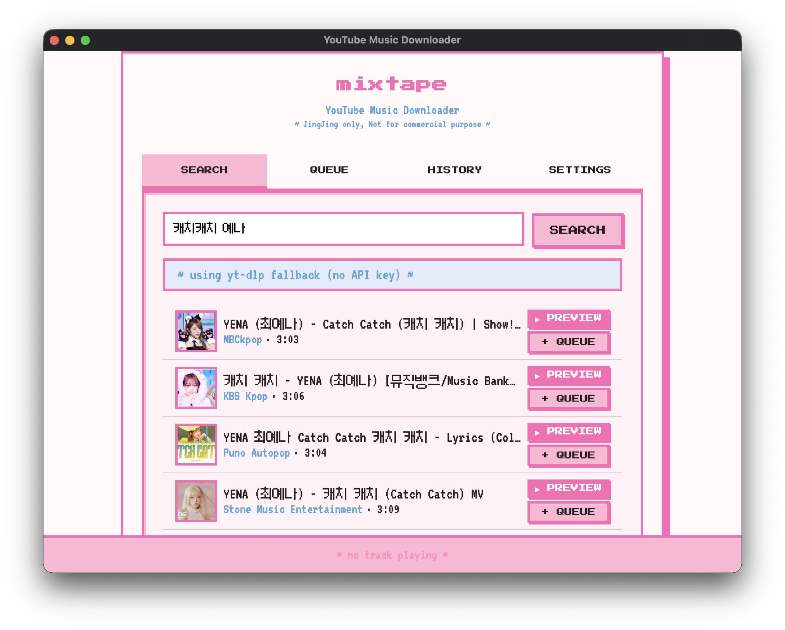
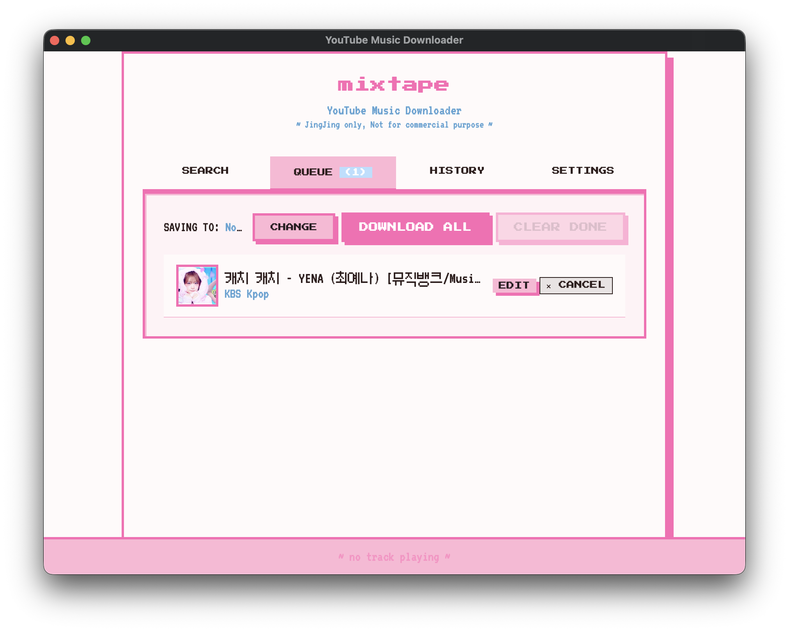
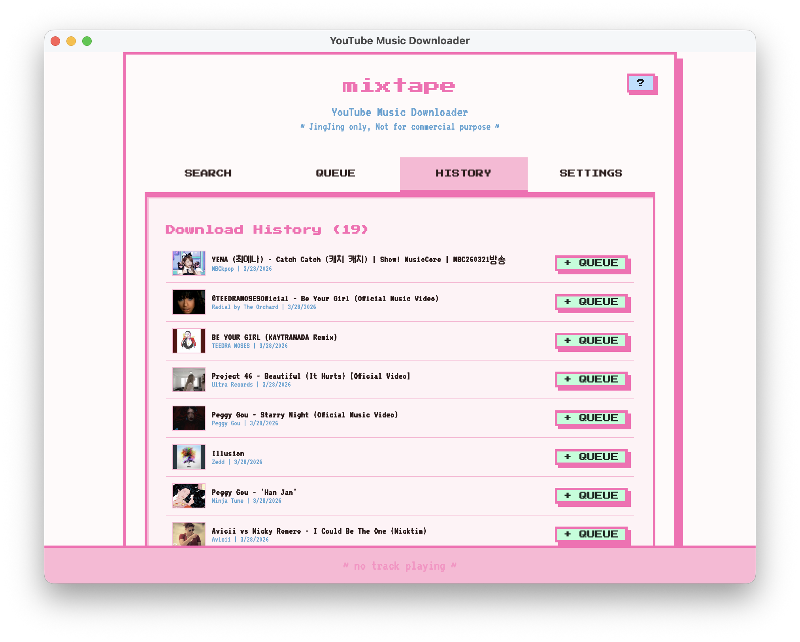
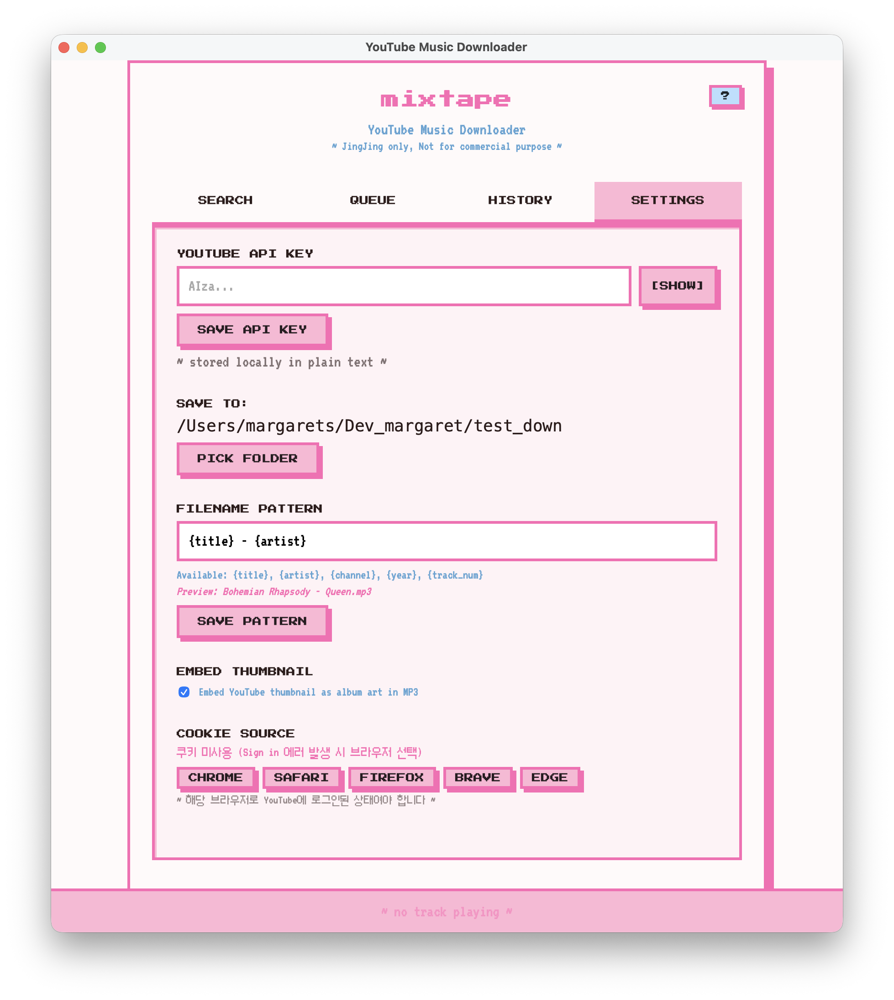

# mixtape 🎵

A personal YouTube music downloader with a Y2K retro aesthetic. Built for private, non-commercial use only.

> ♩ JingJing only, Not for commercial purpose ♩

## Screenshots

| Search | Queue |
|--------|-------|
|  |  |

| History | Settings |
|---------|----------|
|  |  |

## Features

- **Search** — Find YouTube videos by keyword; falls back to yt-dlp scraping when no API key is set
- **Queue** — Add tracks to a download queue and batch-download them at once
- **History** — Browse past downloads and re-queue any track with one click
- **Settings** — Optional YouTube Data API key, custom save folder, and configurable filename pattern (`{title}`, `{artist}`, `{channel}`, `{year}`, `{track_num}`)

## Built With

- [Tauri](https://tauri.app) — native macOS/Windows/Linux shell
- React + TypeScript — frontend UI
- [yt-dlp](https://github.com/yt-dlp/yt-dlp) — video/audio extraction
- [ffmpeg](https://ffmpeg.org) — MP3 conversion (yt-dlp extracts the stream; ffmpeg handles the audio encoding)

> yt-dlp and ffmpeg are always bundled at their latest versions. This is intentional — yt-dlp needs frequent updates to keep up with YouTube changes, and we want to make sure things keep working without any action needed on your end.
> / yt-dlp와 ffmpeg는 항상 최신 버전으로 번들됩니다. YouTube의 잦은 변경에 계속 대응하기 위한 의도적인 선택으로, 별도 조치 없이도 정상 동작을 유지할 수 있습니다.

## Install

### macOS

```bash
# Homebrew (recommended)
brew tap Margarets00/mixtape
brew install --cask mixtape

# or curl
curl -fsSL https://raw.githubusercontent.com/Margarets00/mixtape/main/install.sh | sh
```

### Windows

```powershell
# Scoop
scoop bucket add mixtape https://github.com/Margarets00/scoop-mixtape
scoop install mixtape

# or PowerShell
irm https://raw.githubusercontent.com/Margarets00/mixtape/main/install.ps1 | iex
```

### Linux

```bash
curl -fsSL https://raw.githubusercontent.com/Margarets00/mixtape/main/install.sh | sh
```

> Homebrew/Scoop variants are **no-preinstall** builds — yt-dlp and ffmpeg must be installed separately (brew/scoop handle this automatically as dependencies). The app will guide you if anything is missing.

## Download

Pre-built binaries are available on the [Releases](../../releases) page.

Two variants are provided per platform:

| Variant | File suffix | yt-dlp / ffmpeg |
|---------|-------------|-----------------|
| **Full** | *(none)* | Bundled — install and run immediately |
| **No-Preinstall** | `-np` | Not bundled — you must install yt-dlp and ffmpeg separately |

### Full (recommended)

| Platform | Arch |
|----------|------|
| macOS | Universal (Apple Silicon + Intel) |
| Windows | x86-64 |
| Linux | x86-64 |

Download the installer for your platform and launch. No extra setup required.

### No-Preinstall

For users who already have yt-dlp and ffmpeg installed (e.g. via Homebrew, pip, winget).
The app detects them automatically on launch; if not found, a setup screen lets you point to the binaries manually.

Install dependencies first:

```bash
# macOS
brew install yt-dlp ffmpeg

# Windows
winget install yt-dlp
winget install ffmpeg

# Linux / pip
pip install yt-dlp
sudo apt install ffmpeg   # or equivalent
```

Then download the `-np` installer from the Releases page.

## Build From Source

```bash
# Prerequisites: Node.js, Rust, Cargo

# Full build (bundles yt-dlp + ffmpeg sidecars)
npm install
bash scripts/download-sidecars.sh   # downloads yt-dlp + ffmpeg binaries
npm run tauri build

# No-preinstall build (no sidecars — users provide their own yt-dlp/ffmpeg)
npm install
npm run tauri build -- --config src-tauri/tauri.nopreinstall.conf.json
```

## Legal Notice & Copyright Disclaimer

This project is a **personal, non-commercial tool** created for private use only. It is not affiliated with, endorsed by, or connected to YouTube, Google LLC, or any content creators.

**Important:**

- Downloaded content remains the intellectual property of its respective copyright holders.
- This tool does **not** circumvent DRM or any access-control measures.
- Downloading YouTube videos may violate [YouTube's Terms of Service](https://www.youtube.com/t/terms). You are solely responsible for ensuring your use complies with applicable laws and platform terms in your jurisdiction.
- This software is provided "as is" for educational and personal archival purposes. The author accepts no liability for misuse.

**Do not use this tool to:**
- Download and redistribute copyrighted content
- Generate revenue from downloaded material
- Infringe on any creator's rights

Please support artists and content creators by consuming their work through official channels.

## License

[MIT](LICENSE) — the source code is freely available, but this license does not grant any rights to content downloaded through the tool. See Legal Notice above.
